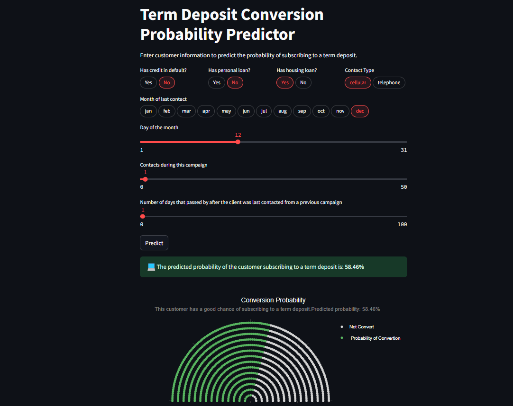

# CRISP-DM-Classification
End to End Classification project using the CRISP-DM framework

The complete description of this project is in this Medium post: 

[How I Created a Data Science Project Following CRISP-DM Lifecycle](https://towardsdatascience.com/how-i-created-a-data-science-project-following-a-crisp-dm-lifecycle-8c0f5f89bba1?sk=f52e756c664f40ad267fd54b114ab901)


## Project Documentation
Follow this link for project documentation.

[Documentation](https://gurezende.github.io/CRISP-DM-Classification/)


## Term Deposit Conversion Probability Predictor App


This repository contains a Streamlit application designed to predict the probability of a customer subscribing to a term deposit, based on a pre-trained classification model. This tool aims to help bank sales managers optimize their time by identifying customers with a higher likelihood of conversion.

## Overview

The application takes several customer-related features as input and uses a trained machine learning model to predict the probability of the customer subscribing to a term deposit. The predicted probability is then displayed along with a visual representation.

## Features

* **User-Friendly Interface:** Built with Streamlit, providing an intuitive web interface for inputting customer data.
* **Real-time Prediction:** Predicts the conversion probability based on the entered features.
* **Visual Representation:** Displays the predicted probability using a bar chart for easy interpretation.
* **Clear Output:** Shows the probability as a percentage, making it easy to understand.

## Prerequisites

Before running the application, ensure you have the following installed:

* **Python 3.6 or higher**
* **Required Python Libraries:**
    ```bash
    pip install streamlit pandas numpy scikit-learn matplotlib seaborn plotly nbformat
    ```

## Getting Started

#### Prerequisites
Git installed on your system
Docker and Docker Compose installed on your system

#### Step-by-Step Instructions

1. Clone the Credit Risk repository:
Run `git clone https://github.com/gurezende/CRISP-DM-Classification.git` in your terminal.
This will download the CRISP-DM repository to your local machine

2. Start the application using Docker Compose:
Navigate to the crispd directory: `cd crispdm`<br>
Run `docker-compose up --build` to build and start the containers.

#### What to Expect
The MLflow server will be available at http://localhost:5000<br>
The Streamlit app will be available at http://localhost:8501

#### Troubleshooting
If you encounter any issues during the build process, check the Docker Compose logs for errors.<br>
If you're unable to access the MLflow server or Streamlit app, ensure that the containers are running and that the ports are correctly mapped.


## Usage

1.  **Enter Customer Information:** Use the provided input fields (select boxes and sliders) to enter the customer's information for the following predictors:
    * `default`: Has credit in default?
    * `housing`: Has housing loan?
    * `loan`: Has personal loan?
    * `day`: Day of the month of last contact.
    * `contact`: Contact communication type (cellular or telephone).
    * `month`: Month of last contact.
    * `campaign`: Number of contacts performed during this campaign.
    * `pdays`: Number of days that passed by after the client was last contacted from a previous campaign.

2.  **Click "Predict":** Once you have entered all the necessary information, click the "Predict" button.

3.  **View Results:** The application will display the predicted probability of the customer subscribing to a term deposit as a percentage. A bar chart visualizing this probability will also be shown.

## Model

The application relies on a pre-trained classification model (saved as `model6.pkl`). This model has been trained to predict the likelihood of a customer subscribing to a term deposit based on the provided features.

**Note:** The accuracy and performance of the application are directly dependent on the quality and performance of the underlying machine learning model.


## Images
<table>
  <tr>
    <td width="50%"></td>
    <td width="50%"></td>
  </tr>
</table>


## License

MIT License

## Contact

This project was developed by Gustavo R Santos.<br>
[Linkedin](https://www.linkedin.com/in/gurezende/)<br>
[Website](https://gustavorsantos.me)